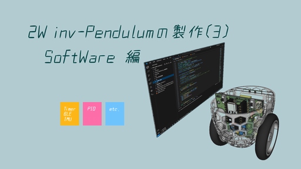

車輪型(2輪)倒立振子の製作

製作内容は、下記 youtube "2w mini inv pendulum Software Description" をご参照下さい。

https://www.youtube.com/watch?v=mnBo8ZFzsgw

ここは、製作動画中 "PID_control_robo" の説明で使用した robo control file のリポジトリとなります。

This is the repository for the robo control file used in the "PID_control_robo" explanation.

//

Copyright (c) 2025/May/06, hir (hir4484@gmail.dom). Available under the MIT License. For more information, see LICENSE.
